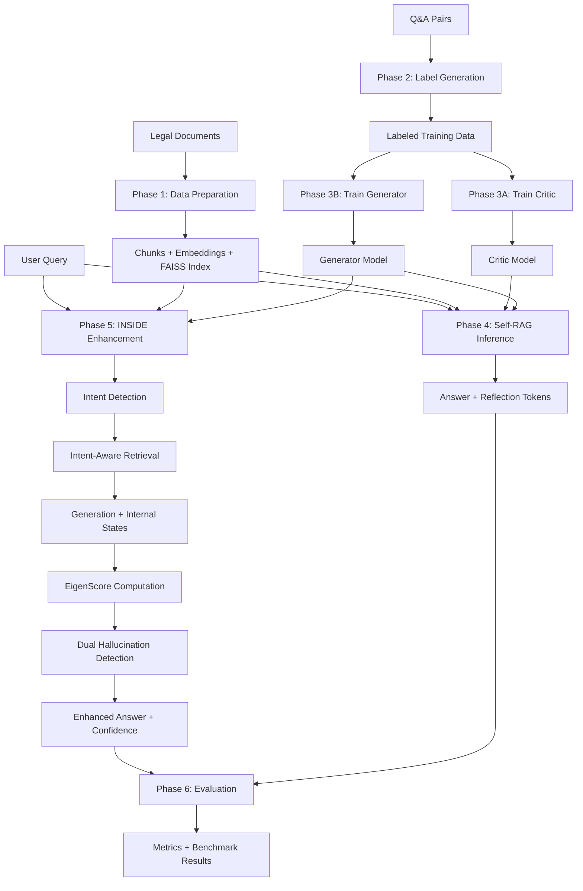

# System Workflow: Self-RAG + INSIDE for Legal Document Analysis

## Overview

This system combines **Self-RAG** (Self-Reflective Retrieval-Augmented Generation) with **INSIDE** (INternal States for hallucInation DEtection) to provide reliable, hallucination-resistant question-answering for legal documents.

**Key Components:**
- **Self-RAG**: LLM with 5 reflection tokens for self-verification during generation
- **INSIDE**: Internal state analysis using EigenScore for post-generation hallucination detection
- **Intent-Aware Retrieval**: Adaptive retrieval strategies based on query classification

---

## Complete Workflow



---

## Phase 1: Data Preparation & Indexing

**Purpose**: Convert legal documents into searchable vector embeddings

**Workflow:**
1. **Chunking** - Split documents preserving structure
   - File: [`src/retrieval/chunking.py`](src/retrieval/chunking.py)
   - Method: RCTS (Recursive Character Text Splitter)
   - Settings: 512 chars, 50 overlap

2. **Embedding** - Convert chunks to dense vectors
   - File: [`src/retrieval/embedding.py`](src/retrieval/embedding.py)
   - Model: `sentence-transformers/all-mpnet-base-v2` (768 dims)
   - Device: MPS (Mac GPU optimized)

3. **Indexing** - Build FAISS vector index
   - File: [`src/retrieval/indexing.py`](src/retrieval/indexing.py)
   - Index Type: IndexFlatIP (exact search)
   - Output: `data/embeddings/` or `data/legalbench_embeddings/`

**Configuration**: [`configs/retrieval_config.yaml`](configs/retrieval_config.yaml)

**Entry Point**: [`notebooks/01_data_preparation.ipynb`](notebooks/01_data_preparation.ipynb)

**Key Class**: `LegalRetriever` in [`src/retrieval/retriever.py`](src/retrieval/retriever.py)

---

## Phase 2: Training Label Generation

**Purpose**: Generate reflection token labels for training data

**Workflow:**
1. Load Q&A pairs from `data/samples/sample_qa_data.json`
2. Generate 5 types of reflection tokens:
   - **Retrieve**: `[Retrieve]`, `[No Retrieval]`
   - **ISREL**: `[Relevant]`, `[Irrelevant]`
   - **ISSUP**: `[Fully Supported]`, `[Partially Supported]`, `[No Support]`
   - **ISUSE**: `[Utility:1]` through `[Utility:5]`
   - **INTENT**: `[Intent:Factual/Exploratory/Comparative/Procedural]`
3. Save labeled data to `data/training/labeled_data.json`

**Methods:**
- **Rule-Based**: Fast, keyword-based heuristics (no API required)
- **GPT-4 Based**: Higher quality using GPT-4 prompts

**Files:**
- [`src/training/generate_labels.py`](src/training/generate_labels.py) - LabelGenerator class
- [`src/self_rag/reflection_tokens.py`](src/self_rag/reflection_tokens.py) - Token definitions + GPT-4 prompts

---

## Phase 3: Model Training (QLoRA)

**Purpose**: Train Critic and Generator models to predict/generate reflection tokens

### Phase 3A: Critic Training

**Workflow:**
1. Load labeled data
2. Fine-tune `Qwen/Qwen2.5-1.5B-Instruct` with QLoRA
3. Train to predict all 5 reflection token types
4. Save LoRA adapters (~50MB)

**File**: [`src/training/train_critic_qlora.py`](src/training/train_critic_qlora.py)

**Config**: [`configs/critic_config.yaml`](configs/critic_config.yaml)

**Model Class**: `CriticModel` in [`src/self_rag/critic.py`](src/self_rag/critic.py)

**Output**: `models/critic_lora/final/`

### Phase 3B: Generator Training

**Workflow:**
1. Load labeled data
2. Use Critic to augment data with predicted tokens
3. Fine-tune `Qwen/Qwen2.5-1.5B-Instruct` with QLoRA
4. Train to generate answers WITH reflection tokens
5. Save LoRA adapters (~50MB)

**File**: [`src/training/train_generator_qlora.py`](src/training/train_generator_qlora.py)

**Config**: [`configs/generator_config.yaml`](configs/generator_config.yaml)

**Model Class**: `SelfRAGGenerator` in [`src/self_rag/generator.py`](src/self_rag/generator.py)

**Output**: `models/generator_lora/final/`

**Entry Point**: [`notebooks/03_self_rag_training.ipynb`](notebooks/03_self_rag_training.ipynb)

---

## Phase 4: Self-RAG Inference

**Purpose**: Standard RAG pipeline with self-reflective generation

**Workflow:**
1. **Query Input** → User question
2. **Retrieval** → FAISS search for top-k relevant passages
3. **Adaptive Retrieval** → Generator decides if more context needed
4. **Generation** → Produce answer with reflection tokens
5. **Token Parsing** → Extract and score reflection tokens
6. **Output** → Answer + reflection metadata + score

**Example Flow:**
```
Query: "What are the elements of negligence?"
  ↓
Retrieval: Top-5 relevant legal passages
  ↓
Generation: "Negligence consists of duty, breach, causation, and damages."
  + [Relevant] + [Fully Supported] + [Utility:5]
  ↓
Output: {
  'answer': "Negligence consists of...",
  'reflection': {'isrel': 'RELEVANT', 'issup': 'FULLY_SUPPORTED', 'isuse': 5},
  'score': 0.95
}
```

**Files:**
- [`src/self_rag/inference.py`](src/self_rag/inference.py) - `SelfRAGPipeline` orchestration
- [`src/self_rag/generator.py`](src/self_rag/generator.py) - Generation + token scoring
- [`src/self_rag/critic.py`](src/self_rag/critic.py) - Token prediction

**Entry Point**: [`notebooks/05_demo.ipynb`](notebooks/05_demo.ipynb)

---

## Phase 5: INSIDE Enhancement (Dual Hallucination Detection)

**Purpose**: Add intent-aware retrieval and internal-state-based hallucination detection

**Workflow:**

### Step 1: Intent Detection
- Classify query into 4 types: FACTUAL, EXPLORATORY, COMPARATIVE, PROCEDURAL
- File: [`src/inside/intent_detector.py`](src/inside/intent_detector.py)

### Step 2: Intent-Aware Retrieval
- Adapt retrieval strategy based on intent:
  - FACTUAL: top_k=3, diversity=0.0 (precision)
  - EXPLORATORY: top_k=10, diversity=0.7 (breadth)
  - COMPARATIVE: top_k=6, diversity=0.5 (contrast)
  - PROCEDURAL: top_k=5, diversity=0.3 (sequential)
- File: [`src/retrieval/inside_retriever.py`](src/retrieval/inside_retriever.py)

### Step 3: Generation with Internal State Extraction
- Generate answer while extracting hidden layer embeddings
- Target layer: 14 (middle of 28 layers)
- File: [`src/inside/internal_states.py`](src/inside/internal_states.py)

### Step 4: EigenScore Computation
- Compute covariance matrix of sentence embeddings
- Calculate eigenvalue spectrum
- Differential entropy: `H = -0.5 × Σ(log(λᵢ))`
- Lower score = less semantic consistency = hallucination
- File: [`src/inside/eigenscore.py`](src/inside/eigenscore.py)

### Step 5: Dual Hallucination Detection
- **Method 1**: EigenScore < threshold → hallucination
- **Method 2**: ISSUP token = `[No Support]` → hallucination
- **Combined**: Both methods for robust detection
- File: [`src/inside/hallucination_detector.py`](src/inside/hallucination_detector.py)

### Step 6: Combined Scoring
- Final score = 0.7 × reflection_score + 0.3 × eigenscore
- Unified quality metric

**Main File**: [`src/self_rag/inside_generator.py`](src/self_rag/inside_generator.py) - `INSIDEGenerator` class

**Configuration**: [`configs/inside_config.yaml`](configs/inside_config.yaml)

**Entry Points:**
- [`notebooks/06_inside_eigenscore.ipynb`](notebooks/06_inside_eigenscore.ipynb) - INSIDE hallucination detection
- [`notebooks/07_intent_aware_retrieval.ipynb`](notebooks/07_intent_aware_retrieval.ipynb) - Intent-aware strategies
- [`notebooks/08_combined_system.ipynb`](notebooks/08_combined_system.ipynb) - Full integration

---

## Phase 6: Evaluation

**Purpose**: Comprehensive assessment of retrieval, generation, and hallucination detection

### Retrieval Evaluation
- **Metrics**: Precision@k, Recall@k, MRR, MAP
- **Per-Intent**: Breakdown by query intent type
- File: [`src/evaluation/retrieval_eval.py`](src/evaluation/retrieval_eval.py)

### Generation Evaluation
- **Metrics**: Hallucination rate, FactScore, ROUGE-L, Utility, Relevance
- File: [`src/evaluation/generation_eval.py`](src/evaluation/generation_eval.py)

### INSIDE Evaluation
- **Metrics**: EigenScore calibration, Intent detection accuracy, Dual detection F1
- File: [`src/evaluation/inside_eval.py`](src/evaluation/inside_eval.py)

### LegalBench-RAG Benchmark
- **Purpose**: Industry-standard legal RAG benchmark
- **Dataset**: 6,858 queries over 714 legal documents
- **Metrics**: Document-level + snippet-level precision/recall
- File: [`src/evaluation/legalbench_eval.py`](src/evaluation/legalbench_eval.py)
- Config: [`configs/legalbench_config.yaml`](configs/legalbench_config.yaml)

**Entry Points:**
- [`notebooks/04_evaluation.ipynb`](notebooks/04_evaluation.ipynb) - General evaluation
- [`notebooks/09_legalbench_benchmark.ipynb`](notebooks/09_legalbench_benchmark.ipynb) - Benchmark

**Output Directory**: `results/`

---

## Quick Start Guide

### 1. Index Your Documents
```python
from src.retrieval.retriever import load_retriever_from_config

retriever = load_retriever_from_config("configs/retrieval_config.yaml")
retriever.index_documents(documents)
retriever.save_index("data/embeddings")
```

### 2. Generate Training Labels
```bash
python src/training/generate_labels.py --input data/samples/sample_qa_data.json --output data/training/labeled_data.json --method rule_based
```

### 3. Train Models
```bash
# Train Critic
python src/training/train_critic_qlora.py --config configs/critic_config.yaml

# Train Generator
python src/training/train_generator_qlora.py --config configs/generator_config.yaml
```

### 4. Run Inference (INSIDE-Enhanced)
```python
from src.self_rag.inside_generator import INSIDEGenerator

generator = INSIDEGenerator.from_config(
    generator_config_path='configs/generator_config.yaml',
    inside_config_path='configs/inside_config.yaml',
    lora_weights_path='models/generator_lora/final'
)

result = generator.generate_with_inside(
    query="What are the elements of negligence?",
    detect_hallucination=True
)

print(f"Answer: {result['answer']}")
print(f"Intent: {result['intent']}")
print(f"Is Hallucination: {result['hallucination_result']['is_hallucination']}")
print(f"Confidence: {result['combined_score']}")
```

### 5. Evaluate System
```python
from src.evaluation.inside_eval import INSIDEEvaluator

evaluator = INSIDEEvaluator(config_path='configs/inside_config.yaml')
results = evaluator.evaluate(test_data)
evaluator.save_results("results/inside_evaluation.json")
```

---

## Directory Structure

```
├── src/                          # Source code
│   ├── retrieval/               # Retrieval pipeline (chunking, embedding, indexing)
│   ├── self_rag/                # Self-RAG system (critic, generator, inference)
│   ├── inside/                  # INSIDE framework (intent, eigenscore, hallucination)
│   ├── training/                # Training scripts (label generation, QLoRA training)
│   └── evaluation/              # Evaluation frameworks (metrics, benchmarks)
│
├── configs/                      # Configuration files (YAML)
│   ├── retrieval_config.yaml    # Retrieval settings
│   ├── critic_config.yaml       # Critic training
│   ├── generator_config.yaml    # Generator training + reflection weights
│   ├── inside_config.yaml       # INSIDE settings (eigenscore, intent)
│   └── legalbench_config.yaml   # Benchmark evaluation
│
├── notebooks/                    # Tutorial notebooks (9 total, ~5-90 min each)
│   ├── 00_getting_started.ipynb
│   ├── 01_data_preparation.ipynb
│   ├── 02_retrieval_pipeline.ipynb
│   ├── 03_self_rag_training.ipynb
│   ├── 04_evaluation.ipynb
│   ├── 05_demo.ipynb
│   ├── 06_inside_eigenscore.ipynb
│   ├── 07_intent_aware_retrieval.ipynb
│   ├── 08_combined_system.ipynb
│   └── 09_legalbench_benchmark.ipynb
│
├── data/                         # Data storage
│   ├── samples/                 # Sample legal docs + Q&A
│   ├── training/                # Generated labels
│   ├── embeddings/              # FAISS indices
│   ├── legalbench_embeddings/   # Benchmark index
│   └── legalbench-rag/          # Benchmark dataset
│
├── models/                       # Trained models
│   ├── critic_lora/final/       # Critic LoRA adapters (~50MB)
│   └── generator_lora/final/    # Generator LoRA adapters (~50MB)
│
└── results/                      # Evaluation results (JSON)
```

---

## Key Design Principles

1. **Modular Architecture**: Each component (retrieval, self-rag, inside) is independent and reusable
2. **Configuration-Driven**: All settings in YAML files for easy experimentation
3. **Efficient Training**: QLoRA (4-bit quantization) enables training on CPU/limited GPU
4. **Mac GPU Optimized**: MPS device support for 5-10x speedup on Apple Silicon
5. **Dual Hallucination Detection**: ISSUP token + EigenScore for ~90% accuracy
6. **Intent-Aware**: Adaptive retrieval strategies based on query type
7. **Comprehensive Evaluation**: Multi-level metrics + industry benchmark

---

## Performance Summary

| Metric | Value |
|--------|-------|
| **Hallucination Rate** | 0-10% (vs 25-40% vanilla RAG) |
| **Hallucination Detection** | ~90% accuracy (dual method) |
| **Retrieval Precision@1** | 6-15% (legal domain) |
| **Retrieval Recall@64** | 60-85% |
| **Inference Speed** | 2-5 sec per response |
| **Training Time** | 11 min for 3 epochs (Mac GPU) |
| **Model Size** | ~50MB LoRA (vs ~13GB full model) |

---

## References

- **Self-RAG Paper**: [https://arxiv.org/abs/2310.11511](https://arxiv.org/abs/2310.11511)
- **INSIDE Paper**: [https://arxiv.org/abs/2402.03744](https://arxiv.org/abs/2402.03744)
- **LegalBench-RAG**: [https://arxiv.org/abs/2406.10667](https://arxiv.org/abs/2406.10667)
- **Base Model**: Qwen/Qwen2.5-1.5B-Instruct
- **Embeddings**: sentence-transformers/all-mpnet-base-v2

---

## Getting Help

For detailed tutorials, see the notebooks in [`notebooks/`](notebooks/) directory:
- Start with [`00_getting_started.ipynb`](notebooks/00_getting_started.ipynb) for a quick 10-minute intro
- Follow the numbered sequence for a complete walkthrough
- Each notebook is self-contained with explanations and runnable code
